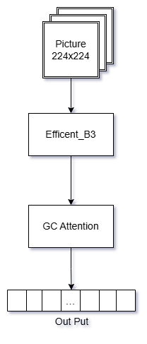
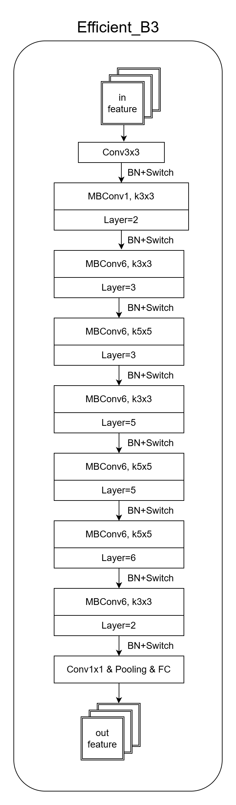
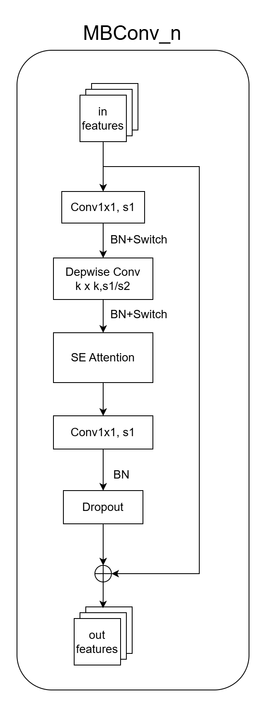
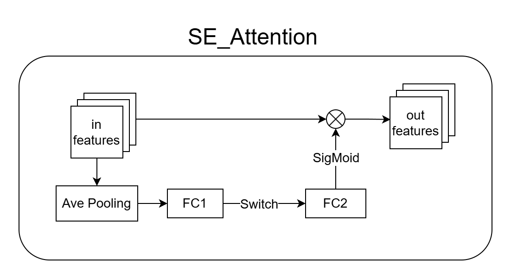
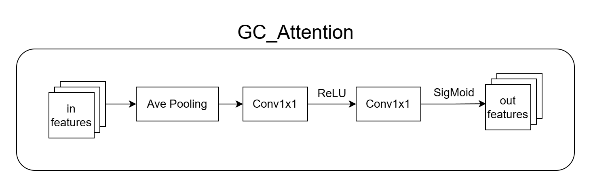
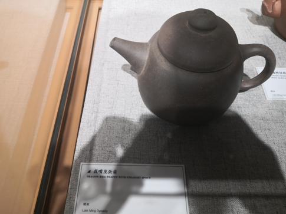
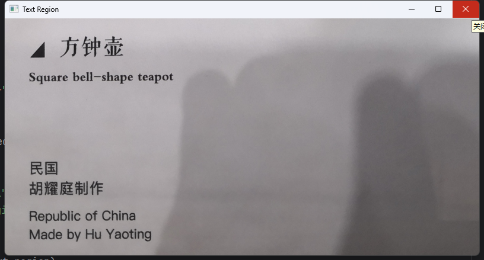
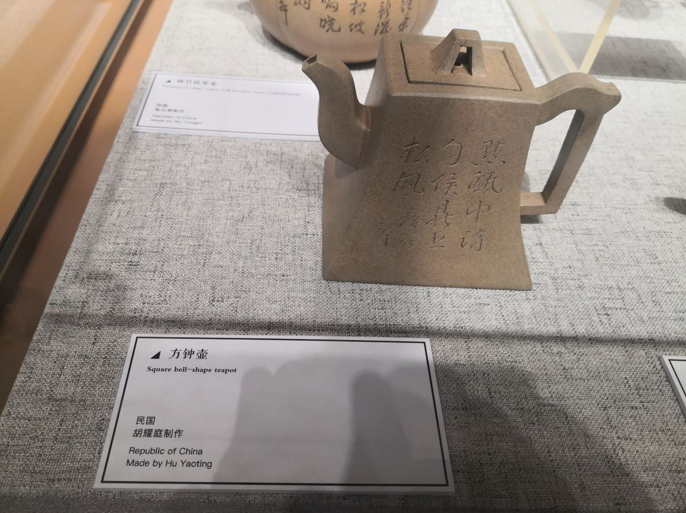
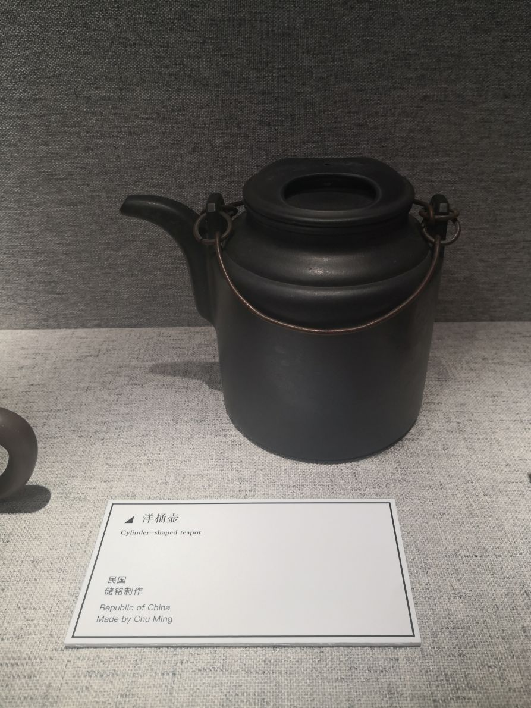
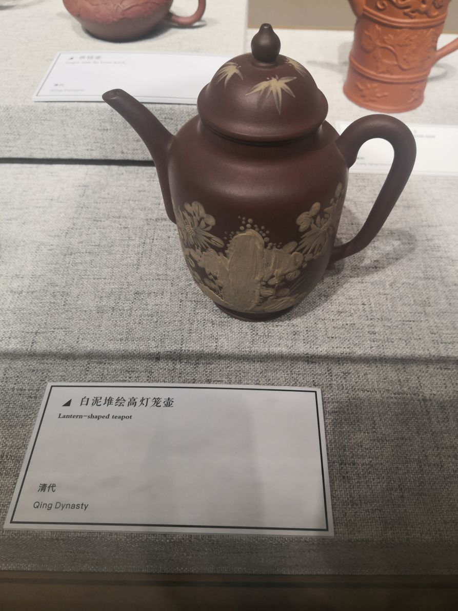

# 茶壶分类器 teapot-classifier

### 一、介绍

茶壶分类模型

本模型使用EfficientNet+注意力机制实现对茶壶的分类。

### 二、模型结构


本网络通过在EfficientNet_b3 模型后加入注意力增强模块，
希望能够避免大幅的背景干扰，关注细节特征，
同时保持高效推理速度。

```
TeaPotClassifier(
  # 主干特征提取网络
  (backbone): EfficientNet_B3(
    (features): Sequential(
      0-16: Conv2d+MBConv块序列  
    )
    (avgpool): AdaptiveAvgPool2d(output_size=1)
    (classifier): Sequential( 
      (0): Dropout(p=0.5)
      (1): Linear(in_features=1536, out_features=512)
      (2): ReLU()
      (3): BatchNorm1d(512)
      (4): Linear(in_features=512, out_features=num_classes)
    )
  )

  # 注意力模块
  (attention): Sequential(
    (0): Conv2d(1536 → 64, kernel_size=1) 
    (1): ReLU()
    (2): Conv2d(64 → 1, kernel_size=1)  
    (3): Sigmoid()
  )
)
```

#### 下面将模型绘制为结构图



首先是整个模型的总览，由 EfficientNet_B3 和 GC_attention 模块链接而成。下面分别具体展示这两个模块的结构。





其次为 EfficientNet_B3 模块的内部结构图。

其中， Stage1 和 Stage9 是首尾模块，负责处理输出输出，
内部的 Stage 2~8 是 MBConv_n 模块的重复堆叠， Layers 表示重复堆叠次数。
下面将具体展示 MBConv_n 的结构图。




MBConv_n 模块作为 EfficientNet_B3 中的核心模块，其结构如图。其中，
- Conv1x1 用于升维。
- DwConv 模块中 k x k 的值由其在 EfficientNet 中所在的位置决定，并已经在其结构图中给出具体参数。
- SE Attention 模块是嵌入的注意力机制，其具体结构图将在下文中给出。
- Dropout 模块在 MBConv_n 内部和外部均有使用，此处的内部 Dropout 的丢弃率参数为 0.2 . 对于整个 EfficientNet 的丢弃率为 0.3.
- 结构末尾是相加的，故要求原特征矩阵和输出的特征矩阵 shape 完全相同。

下面给出 SE Attention 模块结构图。



SE Attention 模块是嵌入 MBConv_n 中的的注意力机制，其中，
- 对于输入首先进行平均池化操作。
- FC1 的节点个数为 MBConv 的输入特征矩阵的通道数的 1/4 .
- FC2 的节点个数为 Depwise 模块输出特征矩阵的通道数。



GC_Attention 模块是链接在 EfficientNet 后的注意力模块，其同样进行了平均池化和降维。


数据集本身具有茶壶种类多，图片总数不多的特征。
对于个别茶壶，可能只有一到两张图片。这可能会造成模型的泛化能力很差，需要从数据集制作的角度入手解决。



茶壶阴影图.png

我们发现博物馆的对展品的打光和人影的遮挡造成了显著的明暗变化，我们不希望光影成为分类依据。
我们希望模型更加注重通过细节和轮廓对茶壶进行分类。

注意到数据集图片中的茶壶距离摄像头远近不一，时常不占据主要画幅，这意味这在训练中要注意背景干扰，考虑引入注意力机制。


### 三、数据集制作

本数据集采用
```zisha teapot dataset```
这个数据集，
其中一共207种不同的茶壶，图片一共286张。
按照9：1：1的比例分为训练集、验证集、测试集。


原始数据集是未经标注的，所以使用图像处理加OCR的方式进行标注。
标注的依据是照片中的展柜上给出的博物馆介绍卡片，
卡片上写有茶壶的名称、时代、作者等信息。

介绍卡的摆放位置不同、相机拍摄角度不同，故需要首先划定出介绍卡所在的区域。
注意到介绍卡颜色梯度变化小，属于低频特征。
由于遮挡和阴影会对处理文字与框选区域造成较大干扰，这在二值化中需要单独处理。
故我们可以通过处理边缘关注卡面将卡所在的取出划定出来。

各个卡片的摆放角度和拍摄角度造成的文字区域和文字畸变，
使原本为矩形的卡片区域在图像中一般表现为不规则四边形。
以文字为正方形为标定的依据，我们可以估计出介绍卡片本身的矩形长宽比为
```1: 2```
。我们将所有的任意四边形区域通过透视坐标变换，规范为
```1: 2```
的矩形。这里得到了较好的纯文字卡片，如下图所示。



方钟壶介绍卡片.png

以改图为基础，进行OCR，可以得到好地识别结果。
选出其茶壶名称的部分，可以作为数据集的标签使用。

标签使用一个cvs 表格进行记录，第以列为原图片的图片名称，第二列为识别得到的茶壶名称。

综上，图像处理的流程是：
1. 先在在图片中提取出博物馆介绍卡所在的区域，。
2. 透视坐标变换为矩形卡片与整齐清晰文字。
3. 调用OCR工具识别文字。
4. 记录茶壶名称与照片名称的对应关系到cvs文件中。


文件结构如下所示：

```
ChaHu/
├── prcCh/
│   ├── get_text.py
│   ├── ocr_results.csv
│   └── ...
├── zisha tea pot dataset/
├── ocr_results_rec.csv
├── train.py
└── ...
```

加载数据时，对数据进行增强

```
    self.train_transform = transforms.Compose([
        transforms.Resize((256, 256)),
        transforms.RandomResizedCrop(224),
        transforms.RandomHorizontalFlip(),
        transforms.RandomRotation(15),
        transforms.ColorJitter(brightness=0.2, contrast=0.2),
        transforms.ToTensor(),
        transforms.Normalize([0.485, 0.456, 0.406], [0.229, 0.224, 0.225])
    ])
    self.val_transform = transforms.Compose([
        transforms.Resize((224, 224)),
        transforms.ToTensor(),
        transforms.Normalize([0.485, 0.456, 0.406], [0.229, 0.224, 0.225])
    ])
    self.transform = self.train_transform if mode == 'train' else self.val_transform
```


### 四、训练过程

| 组件    | 参数/方法            |
|-------|------------------|
| 基础模型  | EfficientNet     |
| 损失函数  | CrossEntropyLoss |
| 优化器   | AdamW            |
| 初始学习率 | 0.001            |  


**初始化阶段**
自动检测使用GPU/CPU设备。构建模型，迁移到目标设备，初始化交叉熵损失和Adam优化器。

**加载数据流**
 数据加载器按9:1的比例提供训练集、验证集。 每个批次32张图像，4个进程并行加载 

**训练循环**   
先进行前向传播，处理输入图像，输出预测结果，然后进行损失函数的计算，比较预测和真实标签。接着进行反向传播，进行自动梯度的计算和参数的更新。 
 
**验证阶段**   
每epoch结束后冻结模型权重，在验证集计算损失和准确率，这个过程中无梯度计算模式提升效率  
 
**输出**   
打印每个epoch的训练损失/准确率/验证损失/准确率，并将训练完成的模型权重保存到my_model.pth中

### 五、实验结果





```
Image: IMG_20240628_141001_1.jpg -> Predicted: 白泥堆绘高灯笼壶,
Image: IMG_20240628_140750_1.jpg -> Predicted: 方钟壶,
Image: IMG_20240628_140826_1.jpg -> Predicted: 洋桶壶
```

*分类性能指标*

| Precision | Recall | F1     |
|-----------|--------|--------|
| 0.4203    | 0.6530 | 0.5114 |


